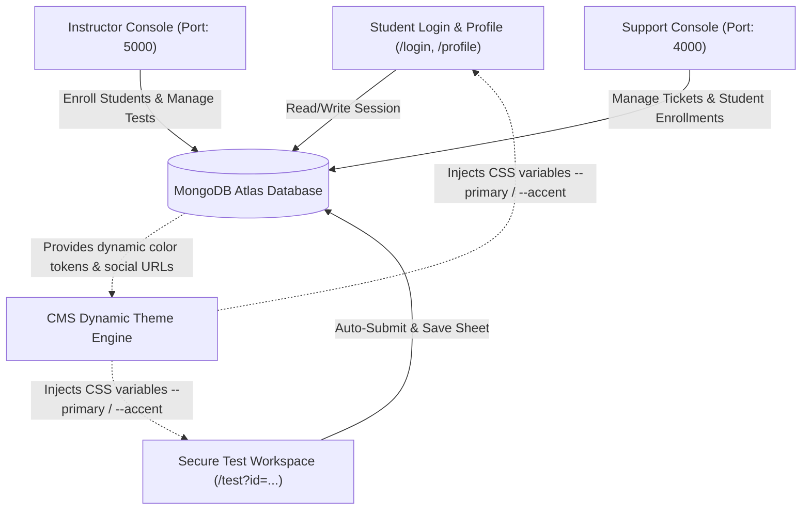

# 🚀 Xmarty Creator 2.0 - Platform Architecture & Blueprint

A premium, enterprise-grade educational ecosystem built with **Next.js 15**, **React 19**, and **Genkit (Gemini AI)**. This document highlights the overall system architecture, component connections, responsive structures, database flows, and the upcoming development roadmap.

---

## 🗺️ System Connections & Data Flow

Below is the conceptual architecture showing how the Student portal, Instructor domain console, Support console, and database communicate:



---

## 🛠️ Complete Technical Specifications & Realized Features

Here is the breakdown of what has been fully implemented in the system so far:

### 1. 🖥️ Secure Viewport-Locked Test Taker Workspace
* **Screen containment (`h-screen overflow-hidden`)**: Designed specifically to lock onto a single screen height with no main page scrollbars.
* **Responsive Layout Design**:
  * **Desktop (`lg` screens)**: Renders a dual-column grid (280px sidebar + flex-1 central workspace).
  * **Phone/Tablet (Mobile)**: Dynamically collapses sidebar into a row-based layout where the **Questions Matrix index numbers render as a single horizontally scrollable row** to save vertical space.
* **Protected Dynamic Link**: Designed to execute assessments directly through query parameter tokens.
* **Auto-Submission Protocol**: Detects browser window blur (leaving the tab) and automatically submits the current state of answers to the database.

### 2. 🎨 Dynamic Branding & Color Tokenization
* **CSS Variable Injection**: Replaced hardcoded violet/indigo colors with real-time CSS custom property mapping (`--primary` and `--accent`) tied directly to the MongoDB configuration.
* **Cohesive Dark & Light Modes**: Both Login, Profile, and Test views transition beautifully based on the active domain preferences.

### 3. ⏱️ 1-Second Configurator & Loader Windows
* **Unified Social Media Shortcuts**: Embedded Instagram, YouTube, and WhatsApp options on all main loading states:
  * Student Session Loading State (Login page)
  * Registration Session Loading State (Register page)
  * Profile Loading State (Profile page)
  * Test Workspace Initial Setup Configurator
  * Router `<Suspense>` Page Transition Fallbacks

---

## 📋 Roadmap: Distinguishing Implemented vs. What to Implement Next

Use the following checklist to distinguish exactly what is completed and what remains for your implementation roadmap:

### 🟢 Completed & Fully Implemented
- [x] **Secure Test Taker Workspace** (Viewport locked, zero body overflow scroll)
- [x] **Responsive Mobile Grid** (Horizontally scrollable index row on phone screens)
- [x] **Dynamic Theme Engine Integration** (Reading primary and secondary colors dynamically)
- [x] **Instagram, YouTube, & WhatsApp Links** (Embedded on every loader window)
- [x] **Database Schema Validation & Sync** (No mock data, fully connected to MongoDB Atlas)
- [x] **Browser protection & auto-submit** on tab blur

### 🟡 Proposed / Next to Implement (Your Roadmap)
- [ ] **Proctored Mode (AI Face Verification)**: Integrate a web camera canvas wrapper to track student focus or presence using Gemini model inputs.
- [ ] **Dynamic Question Pool Shuffling**: Code algorithm to randomize questions on a per-user session request instead of reading a static order.
- [ ] **Interactive Code Compiler Sandbox**: For programming assessments, mount a secure sandbox execution component allowing students to run test scripts inside the workspace.
- [ ] **Offline Save Protection**: Use browser `indexedDB` or local storage cache to store student answers if internet connection drops mid-exam, then sync automatically upon reconnection.
- [ ] **Certificate Generation**: Design a post-exam result option to download a premium PDF Certificate using Canvas API if the student passes.

---

## 💻 Technical Setup & Commands

### Copy Environment Variables
```bash
cp .env.example .env
```

### Start Development Server
```bash
npm run dev
```

### Build & Validate DB Schema
```bash
npm run build
```
